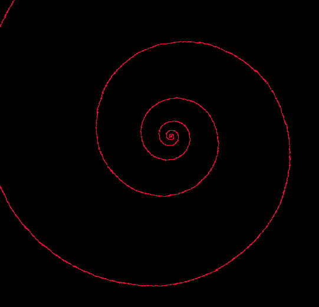

# Plot prime numbers on a circle

Primes numbers are shown circularly with the following algorithm:

- let `n` a prime number, starting at `2`.
- let `displayed_prime` the number of primes already on the circle

- plot `n`, at the following polar coordinates:
    - `r`, the radius, n/20 (20 here is a zooming factor)
    - `θ` the angle, (n * 2 * π) / (displayed_prime - 1);
    - increase `displayed_prime`
    - go to next prime number following `n`

## Screenshot



## Compile and execute

```
git clone git@github.com:rybus/pircle.git
make
./main X Y
```

- `X` is the number of primes you want to display
- `Y` is the expension factor for the spiral (use 1)
- the file  [primes.txt!](primes.txt) contains the list of primes number

## Generate prime numbers

```
./main generate X > primes.txt
```
`X` is the number of prime numbers you want to generate.
